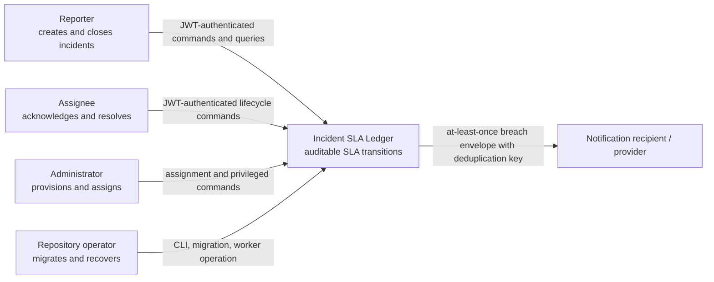

# C4 Level 1 — System Context

## Boundary notes

- Authentication identifies an owner-provisioned principal; it is not a full identity-management product.
- Notification providers are outside the PostgreSQL transaction and may observe duplicates.
- The operator controls database and SMTP credentials and is responsible for transport TLS, backups, and clock discipline.
