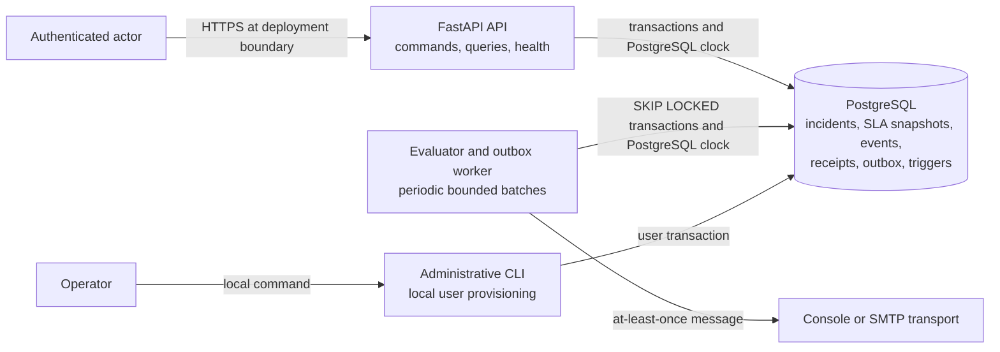

# C4 Level 2 — Containers

## Container responsibilities

| Container | Responsibility | Explicit exclusion |
|---|---|---|
| API | Authenticate, authorize, validate, execute aggregate commands, serve queries | Scheduling, external side effects, public registration |
| Worker | Detect overdue objectives, lease outbox rows, invoke transport | Owning incident policy or changing lifecycle |
| CLI | Owner-controlled initial user provisioning | Public user administration |
| PostgreSQL | Transactional state, locks, shared clock, constraints, history, receipts, outbox | External-message acknowledgement |
| Transport | Console evidence or SMTP submission | Exactly-once consumption guarantee |
