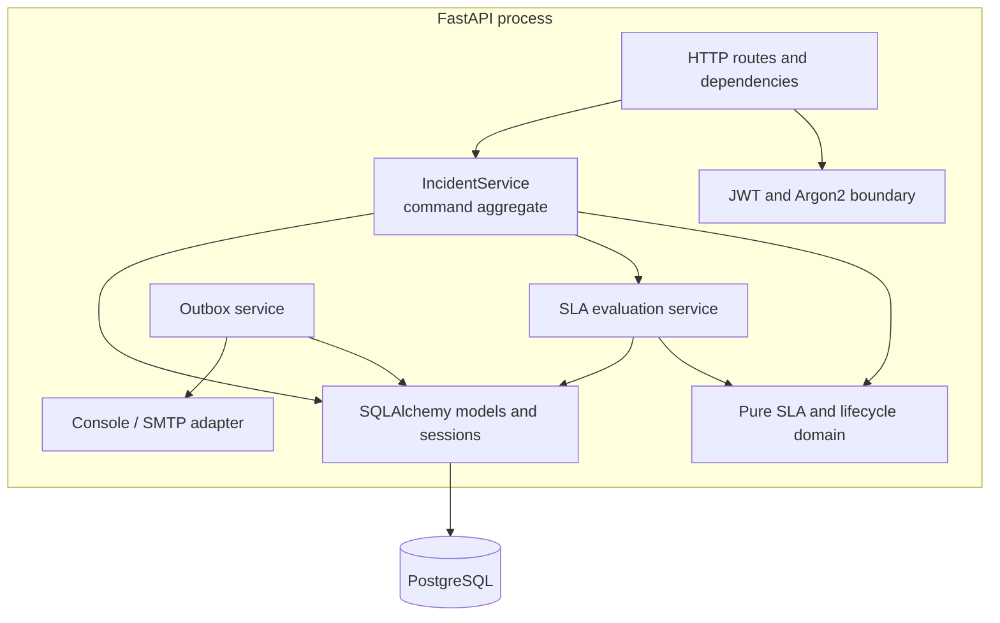

# C4 Level 3 — Components

## Important dependency directions

- Pure domain code does not import FastAPI, SQLAlchemy, or transport code.
- Route functions delegate mutation semantics to services rather than editing ORM objects directly.
- The evaluator and command service call the same deadline functions.
- Outbox publication occurs in the breach transaction, while external delivery occurs later.
- Transport adapters do not decide whether a breach exists.
