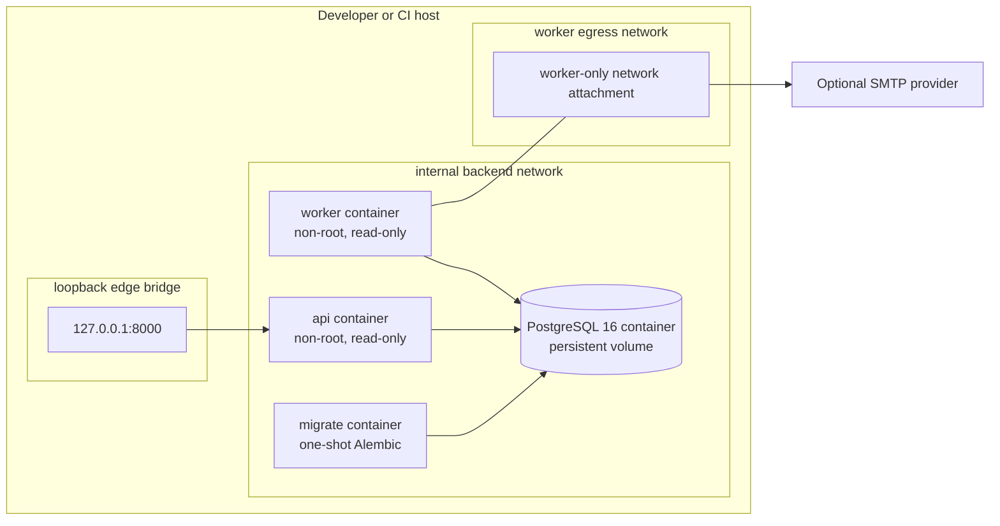

# C4 Deployment View — Supplied Compose Topology

## Deployment qualifications

- Compose is a development and evidence topology, not a production platform prescription.
- TLS termination, secret injection, backups, process supervision, SMTP trust, and network policy belong to the deployment environment.
- The image and Compose controls were observed in the local candidate smoke gate; they remain development evidence rather than a production deployment prescription.
- PostgreSQL has no published host port in this topology.
- The API edge bridge exists to publish loopback port 8000; it is not a production egress-deny policy.
